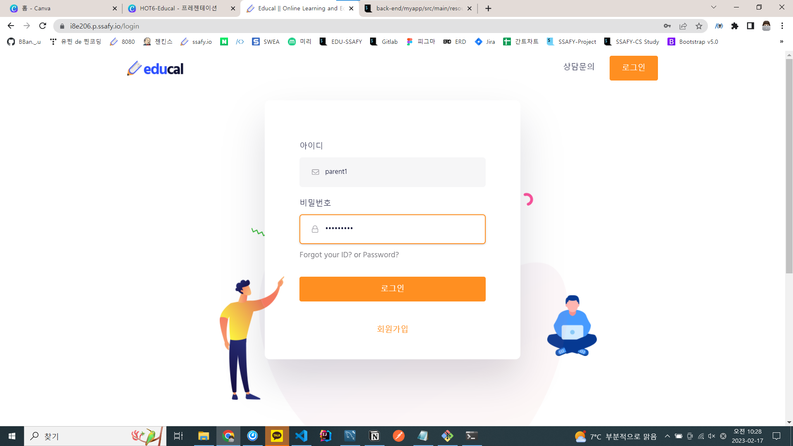
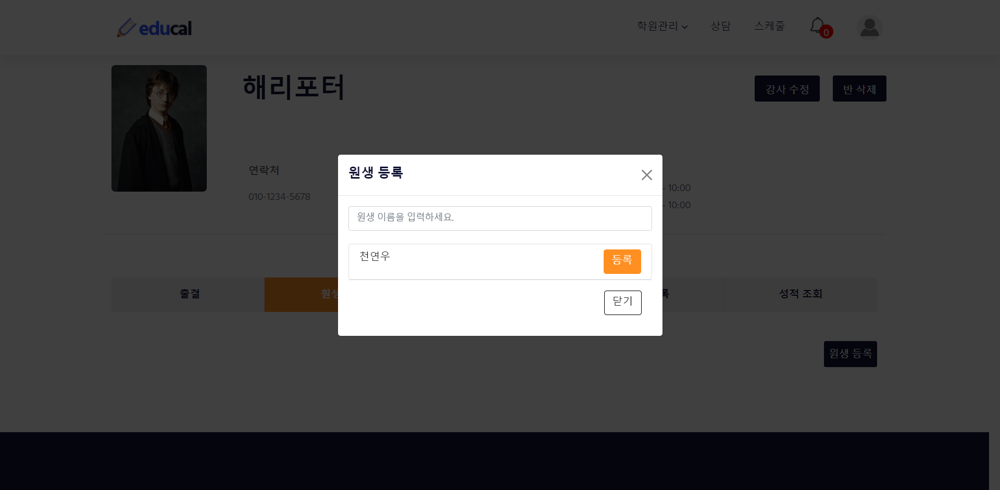

## 1. [가입 과정](#가입-과정)

## 2. [학부모](#학부모)

## 3. [학원장](#학원장)

## 4. [강사](#강사)

## 5. [1:1 화상 상담](#11-화상-상담-기능)

 

---

 

# 가입 과정

### - 학원장일 경우: 학원 등록하기

### - 학부모/강사일 경우: 회원가입 또는 로그인 페이지로 이동한다.

 
 

# 학부모

## 자녀 등록

### navbar에서 자녀 목록을 들어가거나, 자녀 등록을 이용

 

### 자녀 등록 페이지

 

---

## 학원 등록

### 학원 등록 버튼 클릭

 

### 학원 등록 신청 버튼 클릭

 

---

### 자녀 출결 확인

 

### 반 진도

 

### 성적 조회

 

### 성적 상세 보기 (시험 성적 추이)

 

# 학원장

### 학원장이 학생 등록 신청 승인

 

### 학원장이 강사 등록 신청 승인

 

### 반 등록 페이지

 

### 반에 원생 등록

 

### 등록할 원생 선택

 

### 원생 등록 확인

 

### 학원 전체 강사 목록 (강사 삭제 가능)

 

### 학원 전체 원생 목록 (원생 삭제 가능)

 
 

# 강사

 

### 강사 학원 반 목록 navbar

 

### 원생 출결 관리

 

### 반 진도 관리

 

### 시험 성적 등록

 

### 시험 성적 조회

 
 

# 1:1 화상 상담 기능

### 학부모 - 상담 예약

 

### 상담 예약, 내역 페이지

 

### 입장 화면

### 상담 화면

#### 자녀 포트폴리오를 활용한 상담

 
